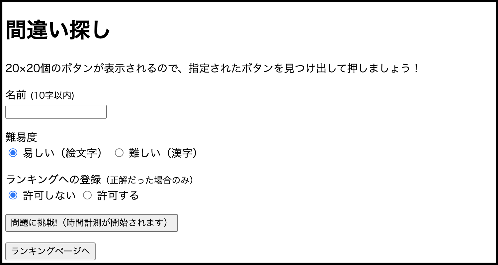
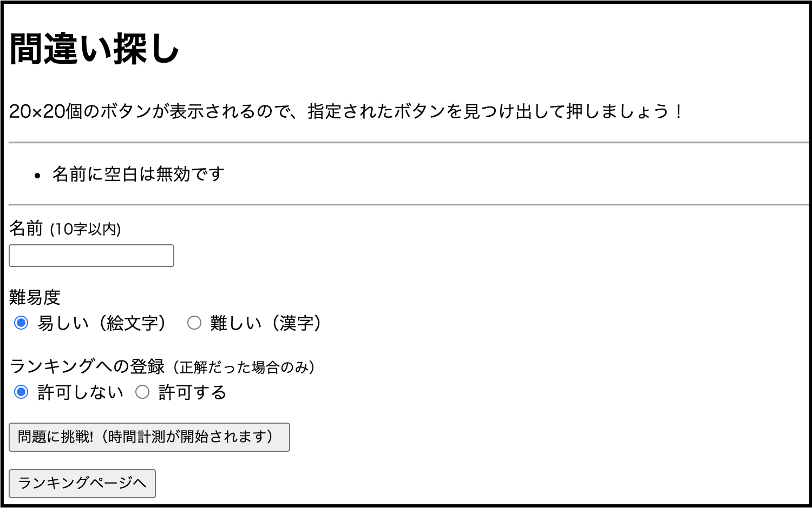
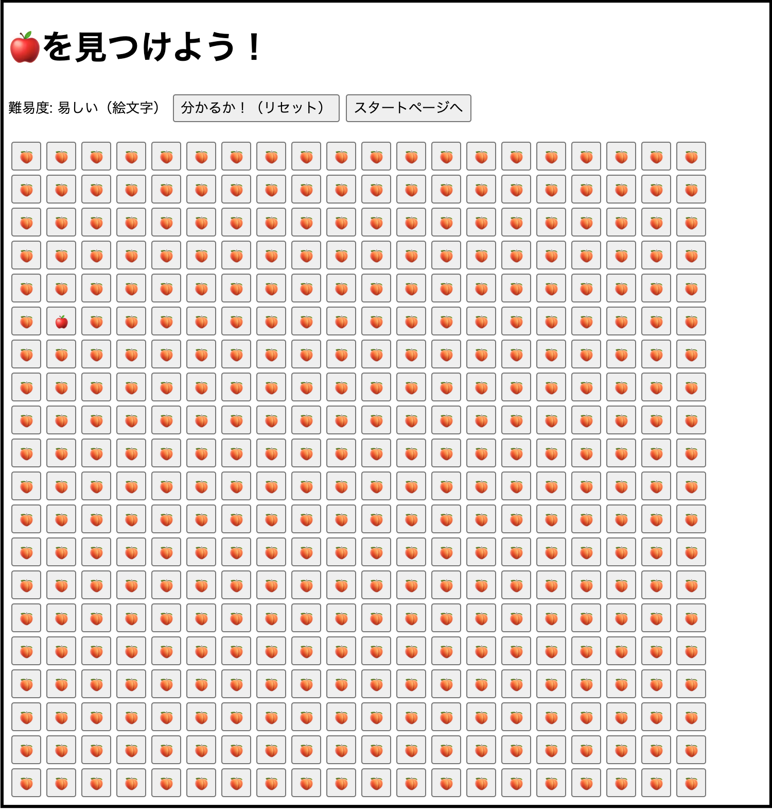
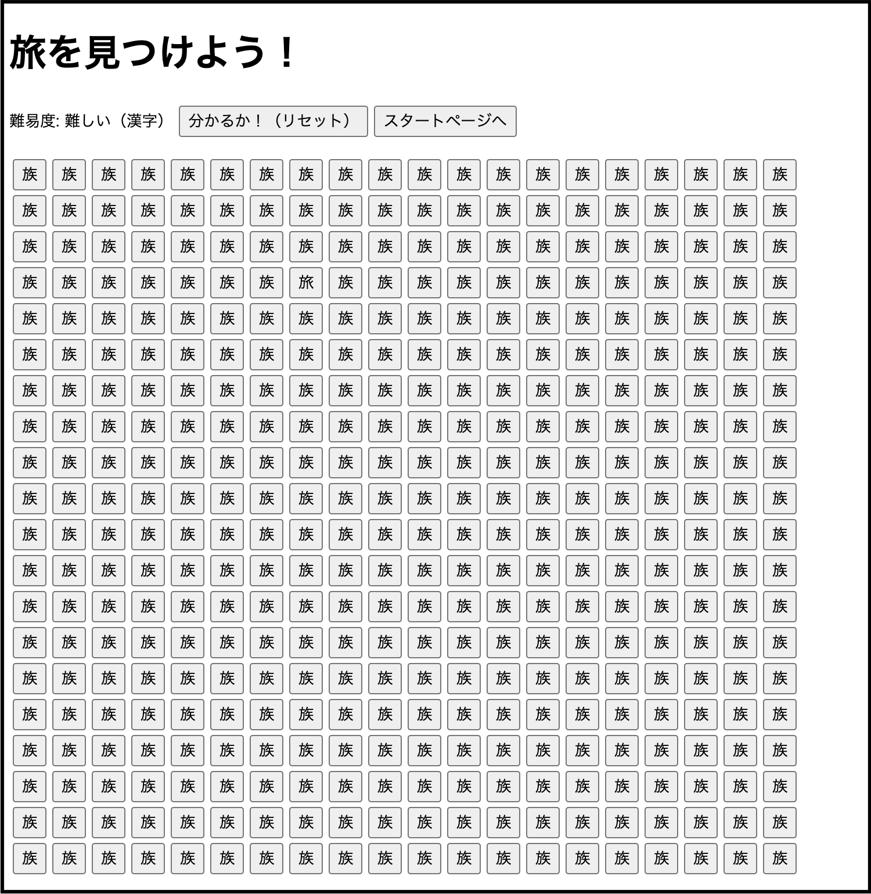
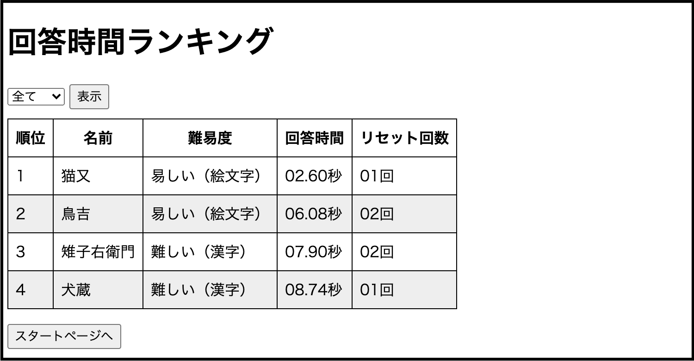

# [Find the Mistake](https://taturon.com/find_the_mistake/start.php)
## 概要
20×20のボタンの中から指定された文字が表示されたボタンを見つける、シンプルな間違い探しゲームです!

初期画面にアクセスすると、

- **名前**の入力欄
- **難易度**の選択ラジオボタン
- **ランキングへの登録認否**の選択ラジオボタン

が表示されます。

名前入力欄には

- **空白文字のみ無効**
- **１０文字以内**
- **名前の前後に空白文字／制御文字無効**

のバリデーションを入れており、引っかかった場合はエラーが表示されます。

適切な名前を入力し、「問題に挑戦!」をクリックすると選択した難易度に応じた問題が表示されます。

正解・不正解を問わず、ボタンをクリックすると結果表示ページへ遷移し、結果には

- **正解か不正解か**
- **回答に要した時間**
- **難易度**
- **リセット回数**

が表示されます。

「ランキングページへ」をクリックすると回答時間ランキング表示画面へ遷移します。

ランキングは難易度ごとに切り替えることもできます。

## 開発環境

- PHP 7.1.29 (cli)
- MySQL Ver 14.14 Distrib 5.6.44

## 各ファイルの説明
メインとなる**5つ**と補助的な**2つ**の合計**7つ**を作成しました。そこまで数が多くないのとファイル名のみ（相対パス）で参照できるようにする為、全て**同一ディレクトリ内に配置**します。

### メインファイル
- **start.php**
    - プレイヤーに名前/難易度/ランキング登録認否を選択してもらうページを生成するファイルです。
- **find_the_mistake.php**
    - 問題を作成・表示するファイルです。
    - 20×20の文字が書かれたボタンを出現させ、その中に1つだけ正解を紛れ込ませます。
- **db_connect.php**
    - DB接続設定用のファイルです。
    - 下記result.phpとranking.phpで使用します。
- **result.php**
    - 回答が正解していたかどうかを示す結果画面です。
    - 回答時間とリセット回数をカウントする機能を実装し、その結果も示します。
- **ranking.php**
    - ランキングを表示するファイルです。
    - ここでは難易度別にランキングを表示切り替えできる機能も実装します。

### サブファイル
- **create_ranking_table.sql**
    - ランキングデータを保存するテーブルを作成するSQL文を記述したSQLファイルです。
- **style.css**
    - ランキングページのテーブルの見た目を整えるCSSファイルです。

---

こちらのQiita記事[「HTML・PHP・MySQLだけで作る間違い探しゲーム」](https://qiita.com/_Taturon_/items/5a8fb0f179f7ede6a60c)でも解説しています。
